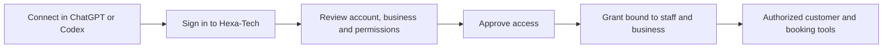

**Hexa-Tech ChatGPT / Codex plugin review — 9 September 2026**

Historical review of the initial draft. The [connected pilot status](chatgpt-pilot-status-2026-09-09.md) and subsequent [CRM and plugin fixes](crm-plugin-fixes-2026-09-09.md) record the later implementation and verification.

Yes, one integration can serve different Hexa-Tech businesses and their staff. The existing draft has a credible foundation, including explicit account approval and organization-bound OAuth grants. **Verdict at initial review: request changes before production enablement or customer distribution.** The package alone is not a working hosted integration.

This review covers the saved instructions, the existing changes on `feature/chatgpt-plugin`, OAuth and MCP implementation, tenant/brand access, booking and note models, existing authentication/subscription middleware, dependency changes, package/ZIP consistency, and release instructions. The user confirmed the audience is businesses and their staff. Application source, existing draft files, dependencies, `.env`, deployment settings, and production data were not changed. This report is the only repository file added by the review; diagnostic tests were written outside the repository in the workstation temporary directory.

The intended customer experience is:

The existing draft uses the canonical Hexa-Tech origin's signed-in application token to establish a separate consent session. Consent shows the staff email and organization. The assistant receives a separate OAuth token, and each request checks identity, organization and access. One shared server and registered OAuth client can support many staff grants; credentials should not be shared between businesses. Someone working in several businesses must sign into the intended workspace before linking; there is no workspace picker in the draft connection screen.

This architecture matches OpenAI's documented OAuth/PKCE account-linking model. Predefined OAuth clients are supported. The existing `.codex-plugin/plugin.json` layout remains a supported compatibility format. [OpenAI authentication](https://developers.openai.com/plugins/build/auth), [OpenAI packaging](https://developers.openai.com/plugins/build/plugins).

**Findings requiring changes**

1. **P1 — Subscription changes can remain unenforced for plugin-only use.** [routes/ai.php](../routes/ai.php) attaches `CheckSubscription`, but OAuth requests do not run the SaaS entitlement refresh or populate its SaaS-authenticated request context. [CheckSubscription.php](../app/Http/Middleware/CheckSubscription.php), lines 145–150, accepts the locally stored `ACTIVE` status without checking its freshness. The existing [entitlement-bust webhook](../app/Http/Controllers/Api/Internal/InternalEntitlementController.php), lines 66–77, only clears the sync timestamp and cache; it expects a subsequent application request to refresh authoritative data. A business that cancels or downgrades and continues using only the plugin can therefore retain stale access. Reproduction used an actual exchanged OAuth token, all MCP middleware enabled, invalidated entitlements and a mocked canceled billing response: `/mcp` returned 200 and made no billing request. Setting the local status to `CANCELED` correctly returned 403, confirming the freshness gap. Add a plugin-compatible authoritative entitlement refresh or webhook-updated entitlement state with a defined freshness policy. Do not forward the MCP-only OAuth bearer to the SaaS billing API.

2. **P2 — Different businesses share an IP-based request quota.** [routes/ai.php](../routes/ai.php), line 14, throttles before token authentication and tenant resolution. The effective route order was verified with `route:list`. Laravel consequently uses source IP rather than verified business/user identity. A test issued real OAuth tokens for businesses A and B: 60 successful MCP calls from A made B's first call from the same IP return 429. This matters when an MCP host uses shared network egress. Apply an authenticated business/user quota after identity resolution, with a separate coarse unauthenticated limit if needed. The OAuth route group also has a shared IP quota; size that separately for linking and token refresh traffic.

3. **Launch requirement — Staff cannot withdraw an OAuth grant inside Hexa-Tech.** [PluginServiceProvider.php](../app/Providers/PluginServiceProvider.php), line 21, disables Passport's default management routes; [plugin-auth.php](../routes/plugin-auth.php) adds issuance/approval/denial, but no grant listing or disconnect operation. Existing application logout and API-token management concern Sanctum tokens. They do not revoke this OAuth grant. Access tokens last one hour and refresh tokens receive a rolling 30-day lifetime. Add a connection-management screen and a tenant/user-authorized operation revoking both access and associated refresh tokens. Confirm a disconnected token fails immediately and cannot refresh. Server-side revocation checking already works; the missing part is the customer-controlled operation.

4. **P2 — Room booking amounts can carry the wrong currency.** [CustomerBookingAccess.php](../app/Mcp/Support/CustomerBookingAccess.php), line 230, uses the organization's current currency for room and CRM reservation amounts. Room price elements already persist booking-specific `currency_code` in [BookingEngineService.php](../app/Services/BookingEngineService.php), lines 2274 and 2291. A diagnostic fixture containing a GBP room booking under an EUR organization was returned as EUR without conversion. Resolve currency from the booking's authoritative data; where unavailable, return unknown rather than relabeling the amount. Review the reservation path too, which makes the same organization-currency assumption.

5. **P2 — Pagination advertises an unusable next page.** [CustomerBookingAccess.php](../app/Mcp/Support/CustomerBookingAccess.php), line 102, can return `next_page: 101`, but [ListBookings.php](../app/Mcp/Tools/ListBookings.php), line 19, rejects pages over 100. Reproduced with 101 reservations, page 100 and limit 1. Use cursor pagination, or explicitly report truncation and require a narrower search at the cap. Avoid implying that an incomplete result set is complete.

6. **Conditional compatibility issue — Direct browser MCP requests fail CORS preflight.** [Cors.php](../app/Http/Middleware/Cors.php), line 60, omits `MCP-Protocol-Version` from allowed headers, and the global middleware answers OPTIONS before the plugin guard. A preflight with an explicitly allowed test origin confirmed the required header was absent. This affects direct cross-origin browser clients sending MCP headers. It does not establish a failure in server-to-server ChatGPT/Codex calls or Inspector's proxy mode. If direct browser transport is supported, add narrowly scoped MCP CORS handling without weakening existing routes.

**Existing behavior exposed by the integration**

Service notes need a portal acceptance check before enabling note writes. The plugin appends to `service_bookings.staff_notes`, but [ServiceBookings.tsx](../frontend/src/pages/ServiceBookings.tsx), line 530, initializes the note editor empty and does not render the persisted field. Saving a later portal note sends replacement text, and [ServiceBookingController.php](../app/Http/Controllers/Api/V1/Admin/ServiceBookingController.php), line 449, replaces the field. Existing plugin notes can therefore be invisible in that drawer and overwritten by normal staff use. This predates the plugin; it is not a newly introduced regression. Resolve or explicitly constrain the service-note workflow before offering it to customers.

The current `mcp:use` approval includes all six tools, including adding notes; the consent and documentation disclose this. Separate read-only approval and business-owner permission to enable staff connections are product choices worth deciding before rollout. Neither is implemented today. Existing navigation visibility settings should not be mistaken for server-side access permissions.

**Protections and compatibility verified**

- Exact callback and resource validation, S256 PKCE, explicit consent and CSRF protection.
- OAuth guard/model separation from existing Sanctum authentication; ordinary app tokens do not authorize MCP, and MCP tokens do not authorize ordinary app endpoints.
- Token signature, issuer, audience, expiry, scope, revocation and signed/database organization checks; refresh rotation and denial after staff deactivation or organization movement.
- Active same-organization staff requirement, retained tenant scopes, assigned-brand restrictions, and room integration visibility. No cross-business data escape was found in the reviewed paths or tests.
- Explicit result field selection rather than full-model serialization; bounded requests and results; note/audit transaction rollback and sequential replay protection.
- Runtime feature flag defaults off; MCP routes register before the SPA catch-all. Existing default authentication guards remain intact, and OAuth tables are additive.
- Lockfile adds 13 packages without removing packages or changing existing locked versions/source references. Composer validation passed. This is not a fresh dependency-security audit; the pasted baseline advisory report was not cleared by this review.
- ZIP has four files, all matching the corresponding plugin directory files by SHA-256. Its MCP configuration supplies the endpoint only, so real OAuth client/callback configuration or registered-app wiring is still required. This limitation is accurately stated in the saved instructions.

**Verification performed**

All PHP commands used `C:\wamp64\bin\php\php8.4.20\php.exe`; runs were scoped and used isolated in-memory SQLite fixtures.

| Check | Result |
| --- | --- |
| `artisan test tests/Feature/ChatGptAuth/ tests/Feature/ChatGptTools/ tests/Feature/ChatGptTransport/` | 36 passed, 302 assertions |
| `artisan test tests/Feature/Auth/ tests/Feature/TenantScope/ tests/Feature/Middleware/ tests/Feature/Security/ tests/Feature/Brand/` | 81 passed, 201 assertions; existing PHPUnit doc-comment deprecation warnings |
| OAuth/MCP diagnostic reproductions | 3 passed, 90 assertions: stale subscriptions, shared tenant quota, CORS |
| Tool diagnostic reproductions | 2 passed, 5 assertions: pagination cap and currency mismatch |
| Composer validation | Passed |
| Effective MCP middleware order | Inspected with `artisan route:list --path=mcp -vv` |

The five diagnostic tests intentionally assert the current defective behavior; their passing confirms the findings, not fixes. They are outside the application test suite: `C:\Users\user6399\AppData\Local\Temp\HexaTechPluginReviewTest.php` and `C:\Users\user6399\AppData\Local\Temp\HexaTechPluginDataReviewTest.php`. Run either using scoped `artisan test <absolute-file> --filter=test_review_` from this repository. The data diagnostic initially needed a fixture correction because the repository's minimal test schema omits production currency columns; its final run passed as listed above.

No development/production migrations, credential provisioning, frontend builds, deployment, or live account linking were performed. Real SaaS JWT login through a browser, full linked tool actions, PostgreSQL migration/locking behavior under concurrent retries, revocation UX, portal note visibility, and production release-artifact verification remain outstanding. The existing OAuth-to-MCP test bypasses billing; the added subscription reproduction specifically kept it enabled.

**Path to a customer pilot**

First fix the identified access-lifecycle and correctness issues on the feature branch and decide the initial read/write and staff-approval policy. Prepare a reviewed integration-only source patch against `origin/main` using the repository's [source-patch release process](landing-page-builder.md); the current feature base carries unrelated unshipped work, so merging the whole branch is unsafe. Validate the actual release artifact and PostgreSQL behavior before deployment.

Then provision persistent Passport signing keys and the actual dedicated public OAuth client on a test deployment, using exact callbacks from the intended ChatGPT/Codex connection. Link two test businesses, verify denied cross-business reads/writes, cancellation/deactivation/disconnect, token refresh, quotas and note visibility, then complete the package wiring. OpenAI documents testing the MCP connection before testing the installed package; public directory submission is a separate step. [OpenAI connection testing](https://developers.openai.com/plugins/deploy/connect-chatgpt).

Keep `CHATGPT_PLUGIN_ENABLED=false` until that pilot is ready. The present review does not approve production enablement.
